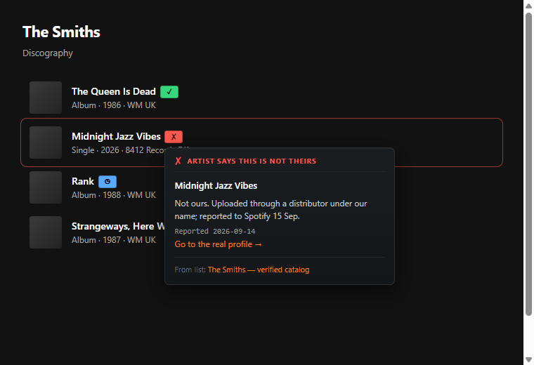
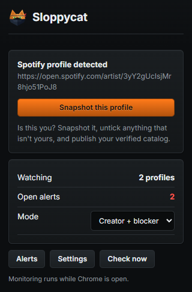
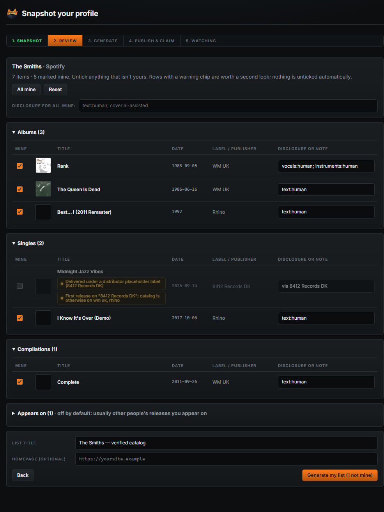
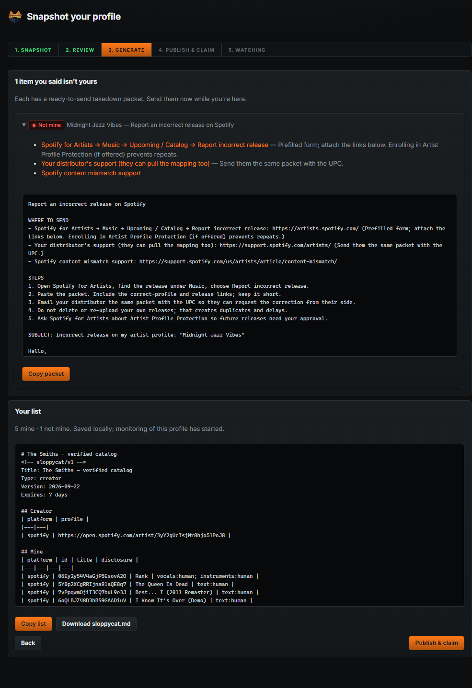
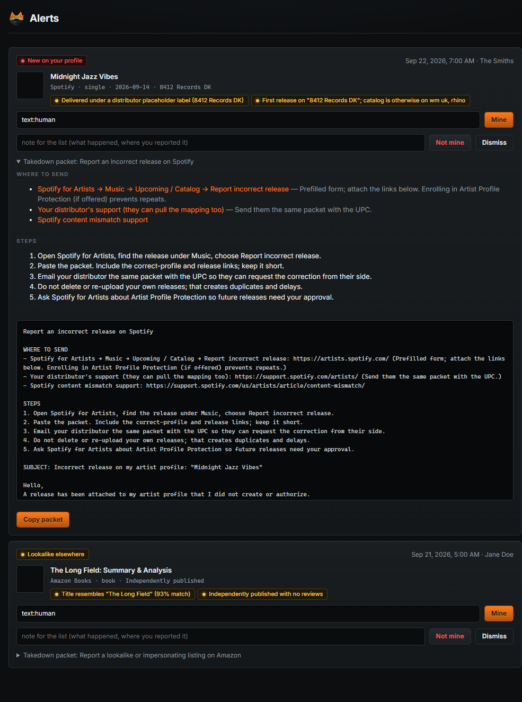
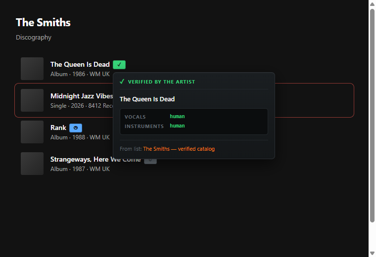
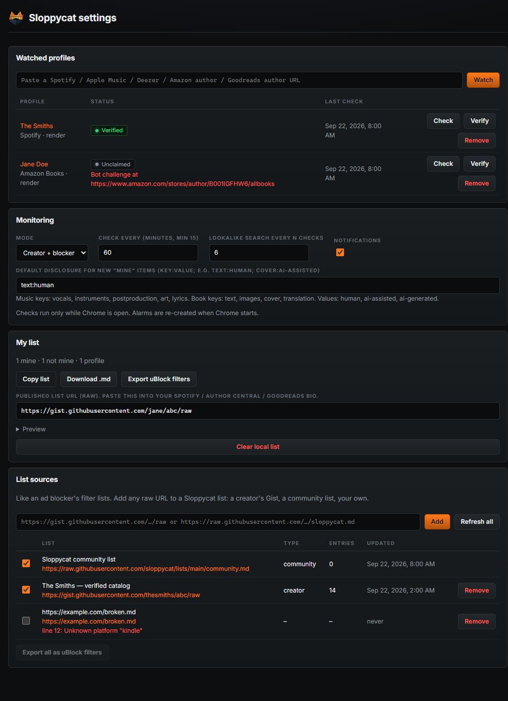

# Sloppycat

**Artists say what's theirs. Everyone else gets to see it.**

Somebody uploads an AI-generated song under a real artist's name, and it lands on that artist's Spotify page
next to their actual records. The scammer gets the royalties. Same trick with books: a knockoff goes up under
a real author's name, or a near-copy of a title that just did well, and the fans who buy it think they bought
the real thing.

The platforms could fix this by asking the artist first. Spotify is beta-testing exactly that. Amazon,
Goodreads, Apple and Deezer aren't doing anything like it, and the wait has been long enough.

So: snapshot your own profile, untick the stuff that isn't yours, publish that as a list. The extension
watches your profiles for new junk and hands you the takedown packet. Other people subscribe to your list and
see the fakes flagged on the page before they press play or buy.

<p align="center">
  
</p>

---

## Contents

- [Install it](#install-it) — it's not in the store yet, so you load it unpacked
- [For artists and authors](#for-artists-and-authors) — snapshot, alerts, takedowns
- [Make your own list](#make-your-own-list) — publish it, prove it's you
- [For slopblockers](#for-slopblockers) — subscribe, badges, uBlock export
- [How it gets the data](#how-it-gets-the-data)
- [What it won't do](#what-it-wont-do)
- [How the trust works](docs/trust.md) and [the research behind it](research/)

---

## Install it

Nothing is published to the Chrome Web Store yet. Build it and load the folder.

```powershell
npm install
```

```powershell
npm run build
```

Then open `chrome://extensions`, turn on **Developer mode**, click **Load unpacked**, and pick the `dist`
folder. `npm run watch` rebuilds while you work.

---

## For artists and authors

### Snapshot your profile

Open your own artist or author page, click the Sloppycat icon, hit **Snapshot this profile**. It reads the
public catalog the same way a fan's browser would.



Supported: Spotify artist pages, Apple Music artists, Deezer artists, Amazon author pages, Goodreads author
pages. You can also paste a URL in Settings if you'd rather not open the page.

Everything starts ticked as yours. You untick what isn't. Nothing is unticked for you, because a guess about
your own catalog is worse than no guess.

<br clear="right">

### Untick what isn't yours

<p align="center">
  
</p>

Releases are grouped by type. "Appears on" starts off, since those are other people's records you play on.
Anything odd gets a chip explaining why it caught the extension's eye, like a release that came through a
distributor's placeholder label when your whole catalog is on one label. A chip is a reason to look, not an
accusation. Plenty of honest releases have one.

### Get the takedown packet

The moment you untick something, you get the letter for it: where to send it, what to paste, which form,
in the right order, with your profile links and the ASIN or album id already filled in.

<p align="center">
  
</p>

Each platform gets its own version, because the routes are genuinely different. Spotify wants the report
form plus your distributor, and it matters that you don't delete and re-upload your own release while you
wait. Amazon splits in two: if the fake is sitting on your author page that's Author Central, and if someone
is selling under your name somewhere else that's the infringement form.

### Then it watches

After the snapshot it keeps checking on a timer, default every hour, minimum fifteen minutes. Anything new
that you haven't already claimed becomes an alert with its packet ready.

<p align="center">
  
</p>

It also searches for near-copies of your titles somewhere else on the platform, which is the other half of
this scam and the half a profile check can't see.

**One limit, stated plainly:** checks only run while Chrome is open. That's as far as a browser extension
reaches. Leave it running and hourly means hourly.

---

## Make your own list

Your list is a Markdown file. That's the whole format. GitHub renders it, people can read it without any
tooling, and a pull request against a community list is reviewable by a human.

```markdown
# Jane Doe — verified catalog
<!-- sloppycat/v1 -->
Title: Jane Doe — verified catalog
Type: creator

## Creator
| platform | profile |
|---|---|
| spotify | https://open.spotify.com/artist/0123456789abcdefghijkl |

## Mine
| platform | id | title | disclosure |
|---|---|---|---|
| spotify | 4aBcdefghijklmnopqrstu | Blue Room | vocals:human; art:ai-generated |

## Not mine
| platform | id | title | first seen | note |
|---|---|---|---|---|
| spotify | 9xYcdefghijklmnopqrstu | Midnight Jazz Vibes | 2026-09-14 | not ours, reported 15 Sep |
```

The wizard writes this for you at the end of the snapshot. Copy it, or download it, or let it open GitHub
with the file already filled in.

**Publish it** anywhere with a plain URL. A public Gist is the least work. The raw URL is what people
subscribe to.

**Then prove it's you.** Paste that URL into a bio only you can edit: Spotify for Artists, Amazon Author
Central, or a claimed Goodreads profile. The extension reads your bio, follows the link, and checks the list
names that same profile back. Both directions have to match. No account, no signup, nothing to trust me with.

The `disclosure` column is yours to use or ignore. If you used AI for the cover and not the words, say so and
it shows up on the hover card. Music keys are `vocals`, `instruments`, `postproduction`, `art`, `lyrics`.
Book keys are `text`, `images`, `cover`, `translation`. Values are `human`, `ai-assisted`, `ai-generated`.
Anything else you write still displays.

**Labels, managers and lawyers:** one list can cover a whole roster. Put every artist's profile in the
Creator table, publish once, and have each artist's bio point at it. You already hold this data, it's what your
DDEX or ONIX feed says. Nobody publishes it anywhere a browser can read, which is the only reason this scam
works as well as it does.

Full spec: [docs/list-format.md](docs/list-format.md).

---

## For slopblockers

Subscribe to lists the way you'd subscribe to filter lists in uBlock. Items get a badge on the page, and
hovering gives you the card.

<p align="center">
  
</p>

| | |
|---|---|
| **green ✓** | the artist says this one is theirs |
| **red ✗** | the artist says this is not theirs |
| **blue ◷** | released before the cutoff, so probably fine, but nobody has confirmed it |
| **grey ○** | this artist is enrolled and hasn't said either way yet |

No badge at all means no list covers it. Silence, rather than a guess.

Add sources in Settings. One community list ships enabled; any creator's Gist URL works.

<p align="center">
  
</p>

Already running uBlock Origin and don't want another extension? Export any subscribed list as a cosmetic
filter list and the flagged items get hidden instead of badged. You lose the report card, which is most of
the point, but it works.

---

## How it gets the data

| Platform | How | Notes |
|---|---|---|
| Spotify | Reads the artist data the web player itself loads | Their public API closed in Feb 2026, and the discography page only keeps two albums in the DOM at a time. Gives the 10 newest albums and singles, which is where a hijack shows up anyway. |
| Apple Music | iTunes lookup API | Free, no key. |
| Deezer | Public API | Free, no key. |
| Amazon Books | Renders your author store pages in a hidden tab | The pages are JavaScript now, so there's nothing to fetch. Runs in your own session, so it looks like you browsing, because it is. |
| Goodreads | Fetches the author list pages | Still server-rendered. No API since 2020. |
| Google Books | Volumes API | Only used to spot lookalike titles. |

Nothing leaves your browser except requests to those platforms and to the list URLs you subscribed to. There
is no server, no account, and nowhere for me to see any of it.

---

## What it won't do

**It doesn't detect AI.** Spotify and Deezer already badge AI-generated music and it doesn't help here: a
fake on your page is credited to a human, so nothing flags it. The only person who actually knows whether a
release is yours is you, so yours is the word the badges carry.

**It doesn't file anything for you.** It writes the letter and points at the form. You press send.

**It doesn't accuse people on a hunch.** The heuristics are there to help you look in the right place. They
never end up on anyone's screen as a verdict. A row only reaches the shared community list if the creator
confirms it, or two curators check it and sign off: see [lists/CONTRIBUTING.md](lists/CONTRIBUTING.md).

---

## Working on it

```powershell
npm test
```

```powershell
npm run typecheck
```

```powershell
npm run preview
```

`preview` serves the extension pages with a fake browser API so you can poke at the UI in a normal tab;
`/demo` renders the overlay against a mock platform page, which is where these screenshots come from.

Also here: [who gets to speak for a profile](docs/trust.md) · [user reports](docs/reporting.md) · [research, with sources](research/) · [the list format](docs/list-format.md) · [what ships in the default list](docs/baseline-plan.md) ·
[how the community list is policed](lists/CONTRIBUTING.md) · [marketing notes](docs/marketing.md)

## This needs people whose word carries

An ad blocker is useless without filter lists, and those exist because people commit to maintaining them in
public. Same deal here. The code is the easy half. The half that matters is getting lists published by rights
holders, labels, and the lawyers and journalists who've been explaining this scam to the people it happens to.
If you're one of those people, the format is open and you don't need my permission or an account to publish.
See [docs/marketing.md](docs/marketing.md) for who's being asked and why.

It's a band-aid. The real fix is the platforms asking first, and one of them is finally trying it. Until the
rest catch up, this is the part an artist can do without anybody's permission.
